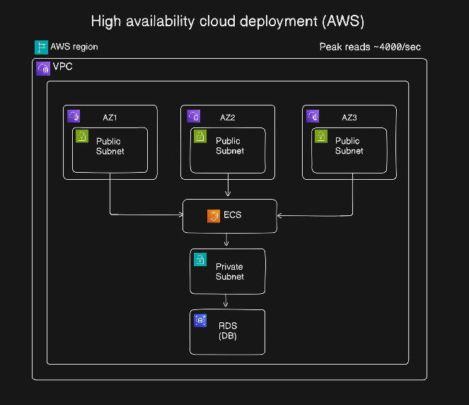
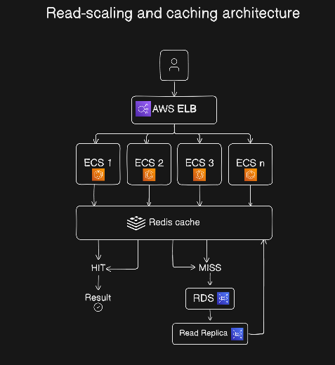

<div align="center">

# Scalable URL Shortener

[](https://github.com/Pratik02-07/Scalable-URL-Shortener/actions/workflows/ci.yml)
[](https://github.com/Pratik02-07/Scalable-URL-Shortener/actions/workflows/cd.yml)


<br />

> **A scalable, production-oriented URL-shortening platform built with FastAPI, PostgreSQL, Redis, Docker, Terraform, and AWS.**
>
> The project demonstrates containerization, CI/CD, infrastructure-as-code, caching, cloud deployment, security, observability, and load testing.
---



<br><br>


</div>

## System Flow

### URL Creation

```text
Client
  │
  │ POST /api/v1/shorten
  ▼
ALB
  │
  ▼
ECS Fargate
  │
  ├── Generate short code
  │
  ├── Store URL → PostgreSQL
  │
  └── Cache mapping → Redis
  │
  ▼
Short URL
```

### URL Redirection

```text
Client
  │
  │ GET /{short_code}
  ▼
ALB
  │
  ▼
ECS Fargate
  │
  ▼
Redis
  │
  ├── Cache HIT ───────────────► 302 Redirect
  │
  └── Cache MISS
          │
          ▼
      PostgreSQL
          │
          ▼
      Store in Redis
          │
          ▼
      302 Redirect
```

The redirect path follows a **cache-first strategy** to minimize database reads and improve latency for frequently accessed URLs.

---

## Tech Stack

| Layer                      | Technology                                       |
| -------------------------- | ------------------------------------------------ |
| **Frontend**               | Next.js, TypeScript                              |
| **Backend**                | FastAPI, Python 3.12                             |
| **Database**               | PostgreSQL / Amazon RDS                          |
| **Cache**                  | Redis / Amazon ElastiCache                       |
| **Containers**             | Docker, Docker Compose                           |
| **Container Registry**     | Amazon ECR                                       |
| **Compute**                | AWS ECS Fargate                                  |
| **Load Balancing**         | AWS Application Load Balancer                    |
| **Infrastructure as Code** | Terraform                                        |
| **CI/CD**                  | GitHub Actions                                   |
| **Testing**                | Pytest, k6                                       |
| **Security**               | IAM, Security Groups, AWS Secrets Manager, Trivy |
| **Observability**          | Amazon CloudWatch                                |
| **Networking**             | AWS VPC, Public/Private Subnets                  |

---

# API

## Shorten a URL

```http
POST /api/v1/shorten
Content-Type: application/json
```

### Request

```json
{
  "url": "https://example.com/very/long/url",
  "custom_alias": "my-link"
}
```

`custom_alias` is optional.

### Response

```http
201 Created
```

```json
{
  "short_code": "aB91xK",
  "short_url": "http://localhost:8000/aB91xK",
  "original_url": "https://example.com/very/long/url",
  "click_count": 0,
  "created_at": "2026-01-01T00:00:00Z",
  "is_active": true
}
```

The `short_url` shown above is an example for local development. In production, it will use the deployed application's domain.

---

## Redirect

```http
GET /{short_code}
```

Returns:

```http
302 Found
Location: https://example.com/very/long/url
```

Resolution follows:

```text
Redis → PostgreSQL → Redis
```

If the short code exists in Redis, the service redirects immediately. On a cache miss, PostgreSQL is queried and the result is stored back in Redis.

---

## URL Statistics

```http
GET /api/v1/stats/{short_code}
```

Returns information such as:

* Original URL
* Short code
* Click count
* Creation timestamp
* Active status

---

## Health Checks

### Liveness

```http
GET /health
```

Response:

```json
{
  "status": "ok"
}
```

### Readiness

```http
GET /ready
```

The readiness endpoint verifies that required backend dependencies are available.

```json
{
  "status": "ready"
}
```

---

# Running Locally

## Prerequisites

* Docker
* Docker Compose
* Python 3.12+
* Node.js 20+

## 1. Clone the repository

```bash
git clone https://github.com/Pratik02-07/Scalable-URL-Shortene.git

cd Scalable-URL-Shortene
```

## 2. Configure environment variables

```bash
cp .env.example .env
```

Update `.env` with your local configuration.

## 3. Build the application

```bash
docker compose up -d --build
```
## 4. Start the application

```bash
docker compose up -d  
```
## 5. Stop the application

```bash
docker compose down
```

### Local Services

| Service               | URL                        |
| --------------------- | -------------------------- |
| **Frontend**          | http://localhost:3000      |
| **Backend API**       | http://localhost:8000      |
| **API Documentation** | http://localhost:8000/docs |
| **PostgreSQL**        | localhost:5432             |
| **Redis**             | localhost:6379             |

---

# Running Tests

From the backend directory:

```bash
cd Backend

python -m pytest tests/ -v
```

The test suite covers:

* API endpoints
* URL service logic
* Database models
* Configuration
* Redis interactions

---

# CI/CD Pipeline

GitHub Actions automates the application's build and deployment workflow.

```text
Git Push / Pull Request
          │
          ▼
    GitHub Actions
          │
          ├── Lint
          │
          ├── Unit Tests
          │
          ├── Integration Tests
          │
          ├── Docker Build
          │
          ├── Trivy Security Scan
          │
          ▼
      Amazon ECR
          │
          ▼
     ECS Fargate
          │
          ▼
     Application
```

The deployment pipeline is designed to ensure that application changes pass automated validation before reaching the AWS environment.

---

# AWS Infrastructure

The production architecture is designed around AWS managed services:

Terraform manages the infrastructure components including:

* VPC
* Subnets
* Route tables
* Internet/NAT gateways
* Security groups
* Application Load Balancer
* ECS cluster
* ECS services
* ECR repository
* RDS PostgreSQL
* ElastiCache Redis
* IAM roles and policies
* CloudWatch resources

---

# Security

The project follows several cloud security practices:

* IAM roles with least-privilege permissions
* Private subnets for application and database resources
* Security groups restricting network access
* AWS Secrets Manager for sensitive configuration
* Non-root Docker container
* Multi-stage Docker builds
* Trivy container vulnerability scanning
* Environment-based configuration
* HTTPS termination at the Application Load Balancer

Secrets and credentials are intentionally excluded from source control.

---

# Observability

Amazon CloudWatch is used for application and infrastructure monitoring.

implemented monitoring includes:

* ECS CPU utilization
* ECS memory utilization
* ALB request count
* ALB latency
* HTTP 4xx/5xx responses
* Application logs
* RDS metrics
* Redis metrics
* Deployment health

CloudWatch alarms can be configured to notify operators when important thresholds are exceeded.

---

# Performance Strategy

The service is designed as a read-heavy system.

Expected workload characteristics:

| Metric                      |             Design Target |
| --------------------------- | ------------------------: |
| **Write throughput**        |           ~4 requests/sec |
| **Average read throughput** |         ~400 requests/sec |
| **Peak read throughput**    | Up to ~4,000 requests/sec |
| **Cache hit ratio target**  |                      >95% |
| **Redirect path**           |               Redis-first |
| **Application scaling**     |    ECS horizontal scaling |

These values represent **architecture/load-testing targets**. Actual production performance should be reported only after validating the deployed system with k6 and collecting corresponding metrics.

---

# Load Testing

k6 is used to evaluate application behavior under increasing traffic.

Example test progression:

```text
100 RPS
   ↓
500 RPS
   ↓
1,000 RPS
   ↓
2,000 RPS
   ↓
4,000 RPS
```

Metrics to evaluate:

* Requests per second
* p50 latency
* p95 latency
* p99 latency
* Error rate
* Redis cache hit ratio
* PostgreSQL utilization
* ECS CPU utilization
* ECS memory utilization
* ALB response time

Performance claims in the project documentation should be updated with the measured results after each load test.

---

# Repository Structure

```text
.
├── Backend/
│   ├── app/
│   │   ├── api/
│   │   │   ├── shorten.py
│   │   │   └── redirect.py
│   │   │
│   │   ├── core/
│   │   │   └── config.py
│   │   │
│   │   ├── db/
│   │   │   ├── base.py
│   │   │   └── session.py
│   │   │
│   │   ├── models/
│   │   │   └── url.py
│   │   │
│   │   ├── schemas/
│   │   │   └── url.py
│   │   │
│   │   ├── services/
│   │   │   ├── url_service.py
│   │   │   └── cache_service.py
│   │   │
│   │   └── main.py
│   │
│   ├── tests/
│   │   ├── test_api.py
│   │   ├── test_url_service.py
│   │   ├── test_database.py
│   │   └── test_config.py
│   │
│   ├── Dockerfile
│   ├── requirements.txt
│   └── pytest.ini
│
├── Frontend/
│   └── Next.js application
│
├── terraform/
│   ├── modules/
│   │   ├── vpc/
│   │   ├── alb/
│   │   ├── ecs/
│   │   ├── rds/
│   │   ├── redis/
│   │   └── ecr/
│   │
│   └── environments/
│       ├── dev/
│       └── prod/
│
├── k6/
│   └── load-test.js
│
├── .github/
│   └── workflows/
│       ├── ci.yml
│       └── cd.yml
│
├── Docs/
│   └── Architectures.png
│
├── docker-compose.yml
├── .env.example
└── README.md
```

---

# Objectives

### High Availability

The production architecture is designed to distribute application workloads across multiple Availability Zones using ECS Fargate and an Application Load Balancer.

### Caching

Redis acts as the primary lookup layer for URL redirects, reducing repeated database queries for frequently accessed short URLs.

### Horizontal Scaling

ECS Fargate allows multiple application tasks to run behind the ALB and scale horizontally based on resource utilization or request demand.

### Infrastructure as Code

Terraform provides reproducible infrastructure and separates infrastructure configuration from application code.

### Automated Delivery

GitHub Actions automates testing, container image creation, security scanning, and deployment to AWS.

### Security

The architecture uses private networking, IAM, security groups, Secrets Manager, and container vulnerability scanning.

---

# Future Improvements

* Custom domain support
* URL expiration
* Authentication and user accounts
* Rate limiting
* API keys
* Analytics dashboard
* Click analytics by country/device/browser
* QR code generation
* Distributed rate limiting
* WAF integration
* HTTPS with ACM
* Blue/green deployments
* Automated rollback
* Cost optimization
* Database read replicas
* Advanced Redis caching strategies

---

## License

This project is intended for learning, experimentation, and demonstrating cloud/DevOps engineering practices.
